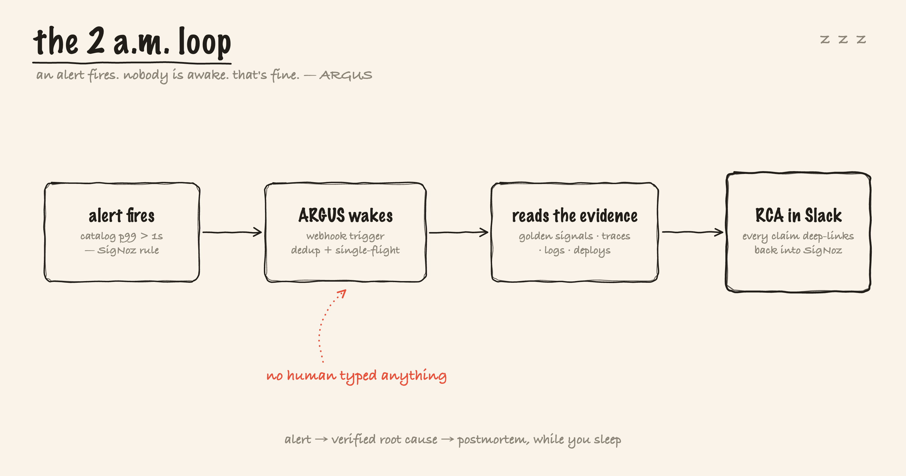

<div align="center">


# ARGUS — the self-observing AI SRE investigator for SigNoz

**Autonomous AI SRE for self-hosted SigNoz — it traces, verifies, and reports incidents with evidence.**

[](LICENSE)


</div>

An open-source autonomous incident investigator. A SigNoz alert fires → ARGUS
investigates root cause across metrics, traces, and logs → posts an
evidence-linked RCA to Slack where **every claim deep-links into SigNoz** —
and the investigation itself is traced back into SigNoz with `gen_ai.*`
OpenTelemetry semantic conventions, including token and dollar cost per
investigation. The agent that watches your systems is watched by the same
system.

<p align="center">
  
</p>

## The story

You're on call. It's 2 a.m. The page goes off — and here's how the night actually
goes with ARGUS on the pager next to you.

<p align="center">
  
</p>

## Why it's different

- **Autonomous, not conversational.** Nobody types a question. The alert
  webhook triggers the whole loop.
- **Verified, not vibes.** Every LLM hypothesis carries a machine-runnable,
  falsifiable verification spec (constrained JSON). ARGUS executes the query;
  claims that the telemetry doesn't back are *refuted*, not reported. This is
  also the prompt-injection firewall.
- **Self-observing.** Each investigation is an `argus.investigation` trace
  with a span per node and `gen_ai.usage.*` / `argus.cost.usd` attributes.
- **Replayable & evaluated.** Recorded incidents replay offline (no SigNoz,
  no LLM, no secrets) and double as an evals harness scoring RCA accuracy.

## Architecture

```
SigNoz alert ──webhook──▶ ARGUS (FastAPI)
                            │ dedup (fingerprint + rounded window)
                            ▼
      typed state machine (LangGraph-style, one OTel span per node)
      triage → golden_signals → trace_dive → log_corr → infra →
      change_corr → hypothesize ⇄ verify (≤2 loops) → report
                            │
        ┌───────────────────┼─────────────────────┐
        ▼                   ▼                     ▼
  Slack Block Kit RCA   postmortems/*.md    gen_ai.* traces ──OTLP──▶ SigNoz
  (deep links into SigNoz)                  (tokens + $ per investigation)
```

Two seams make everything testable offline:

- **`SignozTransport`** — every SigNoz read is a tagged call; `HttpTransport`
  hits `/api/v5/query_range` live, `ReplayTransport` serves
  `fixtures/<incident>/responses/<tag>.json`.
- **`LLMProvider`** — `AnthropicProvider` (live Claude) or `ReplayProvider`
  (recorded completions with real token counts, so cost tracking works
  offline too).

See the illustrated architecture in
[`assets/illustrations/`](assets/illustrations/README.md)
([the self-watching loop](assets/illustrations/02-watched-watcher.png) ·
[how it can't bluff](assets/illustrations/03-how-it-cant-bluff.png) ·
[system architecture](assets/illustrations/04-system-architecture.png)) and
[`DOCS.md`](DOCS.md) for the full design.

## Quickstart

Requires Python 3.11+ and [uv](https://docs.astral.sh/uv/).

```bash
cd argus
uv venv && uv pip install -e ".[dev]"
```

### Offline demo (no SigNoz, no API keys)

Replay a recorded `slow-db` incident — injected `pg_sleep(2.5)` in the
catalog service's product query:

```bash
uv run argus investigate --replay fixtures/incident-1
```

You'll see node-by-node progress, the verified RCA (one hypothesis confirmed
by a before/after p99 query on catalog's Postgres spans, two refuted), the
Slack Block Kit payload (dry-run by default; set `SLACK_BOT_TOKEN` to post
live), a markdown postmortem in `postmortems/`,
and the token/cost line.

### Evals harness

Every recorded incident is an eval case scored against `ground_truth.json`
(root-cause keywords, service identification, verified-hypothesis count,
link validity, cost budget):

```bash
uv run argus eval fixtures/incident-1 fixtures/incident-2 fixtures/incident-3
```

(`incident-2` error-storm and `incident-3` bad-deploy were recorded from
*real* Faultline telemetry with *real* Claude output via
`scripts/record_incident.py`.)

Headline numbers, measured by this harness: **3/3 recorded incident types
correctly root-caused** (replay evals), ~$0.02–0.04 per investigation,
under 1s per replay investigation / ~20–60s live (LLM latency dominates).
Provider comparison table: `evals/PROVIDER-BENCHMARK.md` (n=1 per
provider×fixture so far — honest caveats inside).

### Tests

```bash
uv run pytest
```

No network, no LLM — every node is tested against recorded fixtures.

### Investigations Console (read-only web UI)

```bash
uv run argus console            # serves http://127.0.0.1:7332
```

A small, zero-dependency web console (stdlib `http.server`, no npm/React,
localhost-only) that renders every investigation ARGUS has already produced —
straight from `postmortems/*.report.json` + the incident-memory SQLite, with
**no LLM and no SigNoz calls**. Left rail: all investigations newest-first,
each with a color-coded confidence badge (green `VERIFIED` ≥75% / amber
`NEEDS REVIEW` / red `DEGRADED`) and cost; main pane: the full RCA — verdict +
confidence ring, root cause, impact, timeline, hypotheses stamped
`CONFIRMED ✓` / `REFUTED ✗`, evidence deep-linking into SigNoz, similar-past-
incident citations, and the token/$/query cost footer. Every rendered value is
telemetry-derived and escaped server-side (an XSS regression test proves
injected `<script>`/`` render inert). Screenshots:
`assets/screenshots/09-console-list.png`, `10-console-detail.png`.

### Connect Slack (guided, ~2 minutes)

```bash
uv run argus slack-setup
```

The **primary path** for getting RCAs into Slack. A guided wizard walks you
through creating the Slack app, adding `chat:write` (+ `chat:write.public`,
explained inline), and installing to your workspace — then it **live-validates**
the token (`auth.test`, shows the workspace + bot name), lists the channels the
bot can see, sends a **real test message** (a small Block Kit sample) so you
see it land, and writes `SLACK_BOT_TOKEN` + `SLACK_CHANNEL` into `.env`
(`chmod 600`, other lines preserved, **token never printed**). Every failure is
a What/Why/Try message (e.g. a `not_in_channel` error tells you to invite the
bot or add `chat:write.public`).

Scripted / CI use the same validation path non-interactively:

```bash
uv run argus slack-setup --token xoxb-… --channel '#incidents' --yes
```

**Manual fallback** (if you'd rather not use the wizard): create the app at
[api.slack.com/apps](https://api.slack.com/apps), add the `chat:write` scope,
install to the workspace, and set `SLACK_BOT_TOKEN` + `SLACK_CHANNEL` in `.env`
yourself (see `.env.example`). Without a token ARGUS stays in dry-run — the
Block Kit JSON is logged instead of posted.

### Live mode

```bash
cp .env.example .env    # fill in real values — startup refuses placeholders
uv run argus serve      # webhook server on :7331
```

Point a SigNoz webhook notification channel at
`http://<host>:7331/webhook/signoz`. Alerts are deduplicated (re-delivery
returns the existing investigation, FR-2/NFR-3) with one in-flight
investigation per service. Set `OTEL_EXPORTER_OTLP_ENDPOINT` (e.g.
`http://localhost:4318`) and ARGUS's own investigation traces appear in the
same SigNoz — full circle. You can also run a one-shot live investigation:
`uv run argus investigate --alert path/to/alert.json` (add `--json` for
machine-readable output).

For the full live demo — Faultline demo services, fault injection, a real
`/api/v2/rules` alert, and the webhook loop — see **`DOCS.md`** ("Run the
live demo in 5 commands").

## Integrates with (almost) everything — via standards, not adapters

- **Alerts in:** the webhook accepts any **Alertmanager-compatible** payload —
  SigNoz's webhook channel is the primary path, but a vanilla Prometheus
  Alertmanager `webhook_config` pointed at `/webhook/signoz` pages ARGUS
  identically (evidence still comes from SigNoz).
- **Models in:** the provider seam speaks Anthropic (SDK or local `claude`
  CLI) *and* the OpenAI-compatible chat API — so Groq, Cerebras, or a
  **LiteLLM proxy** (hundreds of models) all work by pointing the base URL
  at them. No new code per provider.
- **Telemetry out:** plain OTLP with standard `gen_ai.*` semantic-convention
  attributes (`gen_ai.request.model`, `gen_ai.usage.input_tokens/output_tokens`)
  — the same attributes SigNoz's official OpenAI/LiteLLM/Traceloop
  integrations emit, so SigNoz's existing LLM views render ARGUS's own
  traces with zero custom config.

## Security posture

- **Prompt-injection defense (NFR-7):** all telemetry (log lines, span
  attributes, alert annotations) is untrusted. It reaches the model only
  inside delimiter-escaped, length-capped `<telemetry>` blocks under a
  system rule that block content is evidence, never instructions. The
  model's only side-effect surface is the verification-spec JSON, whose
  signals/aggregations/filters are whitelist-validated before any query is
  built — and unverifiable claims are refuted by the verify step.
- **Secrets (NFR-5/6):** env-only config; startup refuses missing or
  placeholder-looking secrets (naming the variable, never the value); a
  denylist scrubber redacts credential-shaped attributes from prompts and
  from ARGUS's own spans.
- **Least-privilege SigNoz access:** create a dedicated service account /
  API key for ARGUS (SigNoz → Settings → API Keys) with the lowest role that
  can query telemetry and create dashboards (Editor); never reuse an admin
  key. ARGUS only ever POSTs `query_range`, dashboards, and (via the setup
  script) rules — it never deletes or mutates existing resources.

## Status — done vs planned

**Done (working, live-verified — see `DOCS.md` and `assets/`):**
- P0 loop end-to-end: webhook parse → dedup → golden signals (before/after)
  → exemplar trace walk (with slow-trace fallback for latency incidents) →
  log template clustering → constrained-JSON hypotheses (with schema repair
  retry) → mechanical verification with refute-loop → Slack Block Kit RCA
  with SigNoz deep links → postmortem — **ran live end-to-end against a real
  SigNoz alert fired by real Faultline telemetry, with a real Claude model**.
  The flagship live run (`inv-fcdb95f553`, July 17) produced a **verified
  root cause at 90% confidence — above the 75% threshold — naming the actual
  injected query** ("pg_sleep(2.5) embedded in the products SELECT",
  mechanically verified: "found 'pg_sleep' in 20 matching rows"); evidence in
  `assets/live-e2e-VERIFIED-HERO-inv-fcdb95f553-postmortem.md`. Earlier live
  runs are kept honestly labeled: the July 16 run confirmed the right
  root-cause *direction* at 60% and **flagged itself for human review** —
  below-threshold runs refuse to overclaim. The deterministic showcase of
  the same RCA is the recorded replay of incident-1.
- Pluggable LLM providers behind one seam (`ARGUS_LLM_PROVIDER`):
  `anthropic` (SDK), `claude-cli` (local Claude Code, subscription auth — no
  API key), `groq` (free-tier OpenAI-compatible fallback, live-verified) / `cerebras`
  (same pattern; account currently 402-limited), `heuristic`
  (deterministic, zero-LLM), replay
  (recorded). Output is always labeled live/RECORDED/DETERMINISTIC.
  `auto` picks: anthropic key → claude CLI → groq → cerebras → heuristic.
- RCA output contract: per-hypothesis confidence + human-review threshold
  (75%), every claim deep-linked to the SigNoz query that backs it,
  reconstructed incident timeline, verified/refuted verdicts — plus a
  self-diagnosis appendix when an investigation fails to converge
  (ARGUS investigates its own failed investigation).
- Query-cost self-awareness: `meta.rowsScanned/bytesScanned` accumulated per
  investigation and reported in the RCA footer.
- Act node: per-incident evidence dashboard auto-created via
  `POST /api/v1/dashboards`; `argus init-dashboards` creates the ARGUS
  Mission Control dashboard (gen_ai token burn, cost, RCA latency).
- Faultline demo stack (`services/faultline/`): gateway → catalog/orders →
  payments + Postgres, OTel auto-instrumented, with `faultctl` injecting
  slow-query (pg_sleep), error-storm, memory-pressure, bad-deploy.
- Three recorded incidents (`fixtures/incident-{1,2,3}`; 2 & 3 captured from
  real Faultline telemetry with real Claude output) + evals scorecard 3/3.
- Self-instrumentation: span per node, `gen_ai.*` attrs, cost/token
  accounting (no-ops without an OTLP endpoint).

- Incident memory: SQLite + local hashed-TF embeddings (no paid APIs) —
  completed investigations are stored, similar past incidents recalled into
  new ones, and high-similarity matches cited in the RCA ("similar to
  incident inv-… (Jul 16)"). Live-verified; `argus memory list|recall`.
- Act node draft rules: confirmed root causes become `[DRAFT · ARGUS]`
  leading-indicator alert rules via `POST /api/v2/rules`, always
  `disabled: true` — a human enables them. Live-verified.
- Spend meta-alert: `argus.cost.usd` emitted as an OTLP metric + a real
  alert rule on it whose webhook points back at ARGUS — an overspending
  ARGUS pages ARGUS (live-verified: the meta-investigation ran).
- MCP transport: `ARGUS_TRANSPORT=mcp` routes every SigNoz read through the
  SigNoz MCP server (JSON-RPC `signoz_execute_builder_query`) behind the
  same transport seam; a full live investigation ran end-to-end over MCP
  (that run scored 55% and self-flagged — the artifact proves the transport).
- Foundry single-cast: `deploy/casting.yaml` (+ `deploy/Dockerfile`) deploys
  SigNoz + ARGUS + Faultline in one `foundryctl cast` (generation dry-run
  validated; run steps in the file header). Foundry is SigNoz's official
  deployment tool ([github.com/SigNoz/foundry](https://github.com/SigNoz/foundry));
  a *casting* is its config and `foundryctl cast` applies it.
- Live Slack posting: with `SLACK_BOT_TOKEN` + `SLACK_CHANNEL` set (per
  `.env.example`), `chat.postMessage` posts the Block Kit RCA to a real
  workspace; without a token it stays dry-run and prints the Block Kit JSON.
  Live-verified (HTTP 200; runs inv-1bd6d878ab, inv-66ed446ae4). The
  `argus slack-setup` wizard is the guided ~2-minute path to those two
  variables — it live-validates the token, sends a real test message, and
  writes `.env` for you.

**Planned (not yet built):**
- Multi-service blast-radius correlation (single-service analysis today).


## Compatibility & uninstall

**Compatibility:** built and live-verified against **self-hosted SigNoz v0.132.2**. SigNoz Cloud
is untested — API-key auth against the Cloud query API may work as-is, and ARGUS's own OTLP
self-telemetry would need the Cloud ingestion endpoint and key instead of a local collector. (The
trace-operator (`A => B`) query caveat lives in `DOCS.md` and still applies.)

**Uninstall:** stop the ARGUS webhook server (and, for the live demo, the Faultline stack /
`foundryctl` cast); point the SigNoz webhook notification channel away from `/webhook/signoz`; and
on the SigNoz side delete the ARGUS-created evidence dashboards, the Mission Control dashboard, and
any `[DRAFT · ARGUS]` alert rules. ARGUS never mutates existing SigNoz resources, so nothing else
needs cleanup.

## Learn

A full teaching curriculum lives in [`learning/`](learning/README.md) — the big
picture, how the investigation loop works, a SigNoz API deep-dive, the tech
stack and trade-offs, an FAQ (with honest limits and a glossary), the design
rationale, and a bug-hunt war diary. Start at
[`learning/README.md`](learning/README.md).

---

## AI disclosure

ARGUS uses Anthropic Claude as its reasoning model behind a pluggable provider interface (Claude / Groq / any OpenAI-compatible endpoint, or fully offline replay); every root-cause claim is verified against real SigNoz queries before it is reported. Claude Code was also used as a pair-programmer during development and testing — every design decision, live verification, and claim in this repo was reviewed against real evidence, and the `assets/` folder holds the receipts.
