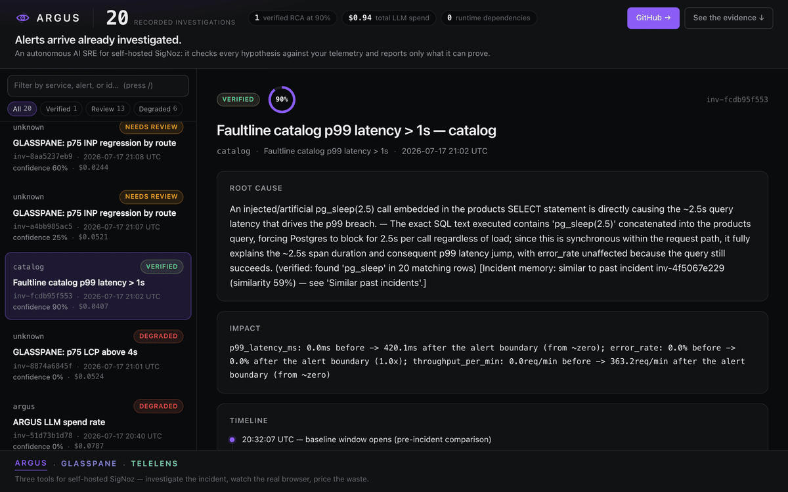
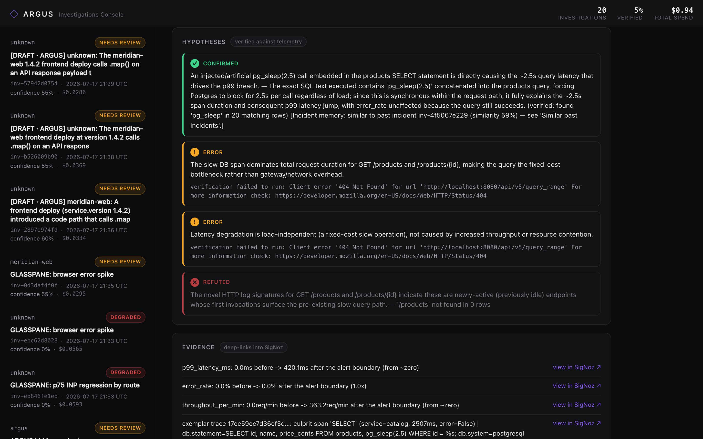
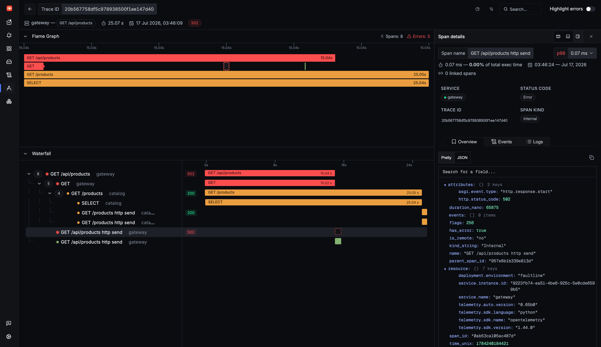
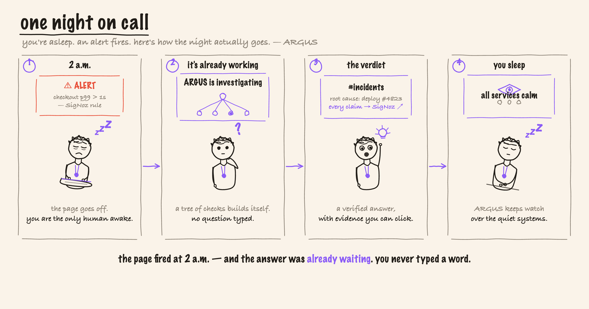

<div align="center">


# ARGUS

**An autonomous AI SRE for self-hosted SigNoz: it investigates alerts, verifies root cause against your telemetry, and posts an evidence-linked RCA.**

[](LICENSE)
[](pyproject.toml)
[](https://github.com/vinayaksonthalia/argus/commits)
[](https://github.com/vinayaksonthalia/argus)

[See it work](#see-it-work) · [Why it's different](#why-its-different) · [Quickstart](#quickstart) · [Architecture](#architecture) · [Integrations](#integrations) · [Security](#security) · [Status](#status) · [Learn](#learn)

</div>

## See it work

A SigNoz alert fires. Nobody types a question. ARGUS investigates across metrics, traces, and logs, tests each hypothesis against real queries, and posts a root cause you can click into SigNoz — and its own reasoning is traced back into the same SigNoz with `gen_ai.*` OpenTelemetry attributes, tokens and dollars included.

<p align="center">
  
</p>

<p align="center"><sub>The console opens on the one run that cleared the 75% bar, then filters down to a run that <em>refused</em> to conclude — "no hypothesis survived verification." Both are in the shipped corpus; 1 of 20 was verified, and that number is not massaged. Browse it yourself: <code>python3 -m http.server -d docs 8000</code>.</sub></p>

| The verified RCA, in the Investigations Console | The evidence itself, back in SigNoz |
|---|---|
| [](assets/screenshots/10-console-detail.png) | [](assets/screenshots/06-hero-trace-pg-sleep-waterfall.png) |
| One hypothesis **CONFIRMED** at 90%, two **REFUTED** — every claim deep-links into SigNoz. | The 25s `SELECT` span ARGUS named as the culprit, in real SigNoz. |

*The flagship live run `inv-fcdb95f553` named the actual injected fault — "pg_sleep(2.5) embedded in the products SELECT", mechanically verified ("found 'pg_sleep' in 20 matching rows") — from a real SigNoz alert fired by real telemetry, with a real Claude model. Receipts: [`assets/live-e2e-VERIFIED-HERO-inv-fcdb95f553-postmortem.md`](assets/live-e2e-VERIFIED-HERO-inv-fcdb95f553-postmortem.md).*

## Why it's different

On-call at 2 a.m., you don't need a chatbot to ask questions of — you need the answer already waiting. ARGUS is triggered by the alert webhook, not by a human prompt, and it refuses to guess: **every hypothesis the model proposes carries a machine-runnable, falsifiable verification spec, and any claim the telemetry doesn't back is *refuted*, not reported.** That verify step is also the prompt-injection firewall — the model's only side-effect is constrained JSON that is whitelist-validated before a single query runs.

- **Autonomous, not conversational.** The SigNoz alert webhook triggers the whole loop; nobody types a question.
- **Verified, not vibes.** Each hypothesis is confirmed or refuted by a real before/after query; below 75% confidence a run flags itself for human review instead of overclaiming.
- **Self-observing.** Each investigation is an `argus.investigation` trace — one OTel span per node, `gen_ai.usage.*` and `argus.cost.usd` attributes — flowing back into the same SigNoz it queries.
- **Replayable & evaluated.** Recorded incidents replay with no SigNoz, no LLM, and no secrets, and double as an evals harness that scores RCA accuracy.

## The story

You're on call. It's 2 a.m. The page goes off — and here is how the night actually goes with ARGUS on the pager next to you.

<p align="center">
  
</p>

## Quickstart

Requires Python 3.11+ and [uv](https://docs.astral.sh/uv/).

```bash
cd argus
uv venv && uv pip install -e ".[dev]"
```

### Offline demo — no SigNoz, no API keys

Replay a recorded `slow-db` incident (an injected `pg_sleep(2.5)` in the catalog service's product query):

```bash
uv run argus investigate --replay fixtures/incident-1
```

You will see node-by-node progress, the verified RCA (one hypothesis confirmed by a before/after p99 query, two refuted), the Slack Block Kit payload (dry-run by default), a markdown postmortem in `postmortems/`, and the token/cost line — all from recorded fixtures with real token counts, so cost tracking works offline too.

<details>
<summary><b>Investigations Console, evals harness, and tests</b></summary>

```bash
uv run argus console   # read-only web UI on http://127.0.0.1:7332 — renders every past RCA from postmortems + memory, no LLM, no SigNoz calls
uv run argus eval fixtures/incident-1 fixtures/incident-2 fixtures/incident-3   # scored against ground_truth.json — 3/3 correctly root-caused
uv run pytest          # 143 tests: every node against recorded fixtures; no network, no LLM
```

The console (stdlib `http.server`, no npm/React, localhost-only) is what the screenshots above show. Filter the rail by service, alert or id, or by status chip; `/` focuses the filter and `j`/`k` walk the list; every RCA has its own `#inv-…` URL. Incidents 2 and 3 were recorded from *real* telemetry with *real* Claude output via `scripts/record_incident.py`. Replay evals: 3/3 recorded incident types correctly root-caused, $0.019–$0.031 per replayed investigation, under 1s each.

**Browse the 20 recorded investigations without installing anything** — the console is also exported to plain static files:

```bash
python3 -m http.server -d docs 8000   # then open http://localhost:8000
```

Regenerate that export after any console change with `uv run python scripts/export_console.py`.
</details>

### Connect Slack (guided, ~2 minutes)

```bash
uv run argus slack-setup
```

A wizard creates the Slack app, adds `chat:write`, live-validates the token (`auth.test`), sends a real test message so you see it land, and writes `SLACK_BOT_TOKEN` + `SLACK_CHANNEL` into `.env` (`chmod 600`, token never printed). Scripted use: `uv run argus slack-setup --token xoxb-… --channel '#incidents' --yes`. Without a token, ARGUS stays in dry-run and logs the Block Kit JSON.

### Live mode

```bash
cp .env.example .env    # fill in real values — startup refuses placeholders
uv run argus serve      # webhook server on :7331
```

Point a SigNoz webhook notification channel at `http://<host>:7331/webhook/signoz`. Alerts are deduplicated (re-delivery returns the existing investigation) with one in-flight investigation per service. Set `OTEL_EXPORTER_OTLP_ENDPOINT` and ARGUS's own investigation traces appear in the same SigNoz. For the full live demo — Faultline demo services, fault injection, a real alert, the webhook loop — see [`DOCS.md`](DOCS.md) ("Run the live demo in 5 commands").

## Architecture

```
SigNoz alert ──webhook──▶ ARGUS (FastAPI)
                            │ dedup (fingerprint + rounded window)
                            ▼
      typed state machine (LangGraph-style, one OTel span per node)
      triage → golden_signals → trace_dive → log_corr → infra →
      change_corr → hypothesize ⇄ verify (≤2 loops) → report
                            │
        ┌───────────────────┼─────────────────────┐
        ▼                   ▼                     ▼
  Slack Block Kit RCA   postmortems/*.md    gen_ai.* traces ──OTLP──▶ SigNoz
  (deep links into SigNoz)                  (tokens + $ per investigation)
```

Two seams make everything testable offline:

- **`SignozTransport`** — every SigNoz read is a tagged call. `HttpTransport` hits `/api/v5/query_range` live; `ReplayTransport` serves `fixtures/<incident>/responses/<tag>.json`; `ARGUS_TRANSPORT=mcp` routes reads through the SigNoz MCP server behind the same seam.
- **`LLMProvider`** — `AnthropicProvider` (live Claude) or `ReplayProvider` (recorded completions with real token counts).

Illustrated: [the self-watching loop](assets/illustrations/02-watched-watcher.png) · [how it can't bluff](assets/illustrations/03-how-it-cant-bluff.png) · [system architecture](assets/illustrations/04-system-architecture.png). Full design in [`DOCS.md`](DOCS.md).

## Integrations

ARGUS integrates through standards, not per-vendor adapters.

| Boundary | What it accepts / emits | Why it just works |
|---|---|---|
| **Alerts in** | Any Alertmanager-compatible webhook | SigNoz's webhook channel is the primary path; a vanilla Prometheus Alertmanager `webhook_config` pages ARGUS identically |
| **Models in** | Anthropic (SDK or local `claude` CLI) and any OpenAI-compatible chat API | Groq, Cerebras, or a LiteLLM proxy (hundreds of models) work by pointing the base URL — no new code per provider |
| **Telemetry out** | Plain OTLP with standard `gen_ai.*` semantic-convention attributes | The same attributes SigNoz's official OpenAI/LiteLLM/Traceloop integrations emit, so SigNoz's LLM views render ARGUS's own traces with zero custom config |

## Security

- **Prompt-injection defense.** All telemetry (log lines, span attributes, alert annotations) is untrusted. It reaches the model only inside delimiter-escaped, length-capped `<telemetry>` blocks under a system rule that block content is evidence, never instructions. The model's only side-effect surface is the verification-spec JSON, whose signals/aggregations/filters are whitelist-validated before any query is built.
- **Secrets.** Env-only config; startup refuses missing or placeholder-looking secrets (naming the variable, never the value); a denylist scrubber redacts credential-shaped attributes from prompts and from ARGUS's own spans.
- **Least-privilege SigNoz access.** Use a dedicated API key with the lowest role that can query telemetry and create dashboards (Editor). ARGUS only ever POSTs `query_range`, dashboards, and draft rules — it never deletes or mutates existing resources.

## Status

Done and live-verified unless marked otherwise. Evidence lives in [`assets/`](assets/) and [`DOCS.md`](DOCS.md).

| Capability | Status | Evidence |
|---|---|---|
| End-to-end loop: webhook → dedup → golden signals → trace dive → log clustering → constrained-JSON hypotheses → refute-loop verify → Slack RCA → postmortem | ✅ Live-verified | Flagship run `inv-fcdb95f553` at 90% ([postmortem](assets/live-e2e-VERIFIED-HERO-inv-fcdb95f553-postmortem.md)) |
| Verified-not-vibes: per-hypothesis confidence, 75% human-review threshold, below-threshold self-flagging | ✅ Live-verified | [`assets/live-e2e-degraded-run-inv-3a51fe90dd-postmortem.md`](assets/live-e2e-degraded-run-inv-3a51fe90dd-postmortem.md) |
| Self-instrumentation: span per node, `gen_ai.*` + `argus.cost.usd`, Mission Control dashboard | ✅ Live | [screenshot 03](assets/screenshots/03-mission-control-dashboard.png) |
| Incident memory: SQLite + hashed-TF recall, similar past incidents cited in the RCA | ✅ Live-verified | [`assets/live-memory-recall-inv-977e5fd4e8-postmortem.md`](assets/live-memory-recall-inv-977e5fd4e8-postmortem.md) |
| Pluggable providers: `anthropic` / `claude-cli` / `groq` / `cerebras` / `heuristic` / `replay` | ✅ Live (groq verified; cerebras 402-limited) | [`evals/PROVIDER-BENCHMARK.md`](evals/PROVIDER-BENCHMARK.md) |
| Act node: per-incident evidence dashboard + `[DRAFT · ARGUS]` alert rules (always `disabled: true`) | ✅ Live-verified | [screenshot 05](assets/screenshots/05-hero-incident-evidence-dashboard.png), [08](assets/screenshots/08-alert-rules-incl-draft.png) |
| Spend meta-alert: `argus.cost.usd` → alert rule → webhook → ARGUS pages ARGUS | ✅ Live-verified | [meta-incident dashboard](assets/screenshots/04-meta-incident-argus-pages-itself-dashboard.png) |
| MCP transport: SigNoz MCP server behind the transport seam | ✅ Live (run scored 55%, self-flagged — proves the transport) | [`assets/live-mcp-transport-inv-5736466ee5-postmortem.md`](assets/live-mcp-transport-inv-5736466ee5-postmortem.md) |
| Live Slack posting: `chat.postMessage` Block Kit RCA | ✅ Live-verified (HTTP 200) | [`assets/live-slack-posting-verified.md`](assets/live-slack-posting-verified.md) |
| Replay + evals harness: 3 recorded incidents scored against ground truth | ✅ Deterministic, 3/3 | `fixtures/incident-{1,2,3}` |
| Foundry single-cast deploy (SigNoz + ARGUS + Faultline) | ⚠️ Generation dry-run validated | `deploy/casting.yaml` |
| Multi-service blast-radius correlation | ❌ Planned | Single-service analysis today |

## Compatibility & uninstall

**Compatibility:** built and live-verified against **self-hosted SigNoz v0.132.2**. SigNoz Cloud is untested — API-key auth against the Cloud query API may work as-is, and self-telemetry would need the Cloud ingestion endpoint instead of a local collector. (The trace-operator `A => B` query caveat in `DOCS.md` still applies.)

**Uninstall:** stop the ARGUS webhook server (and, for the demo, the Faultline stack); point the SigNoz webhook channel away from `/webhook/signoz`; delete the ARGUS-created evidence dashboards, the Mission Control dashboard, and any `[DRAFT · ARGUS]` rules. ARGUS never mutates existing SigNoz resources, so nothing else needs cleanup.

## Learn

A full teaching curriculum lives in [`learning/`](learning/README.md) — the big picture, how the investigation loop works, a SigNoz API deep-dive, the tech stack and trade-offs, an FAQ (with honest limits and a glossary), the design rationale, and a bug-hunt war diary. Start at [`learning/README.md`](learning/README.md).

---

## AI disclosure

ARGUS uses Anthropic Claude as its reasoning model behind a pluggable provider interface (Claude / Groq / any OpenAI-compatible endpoint, or fully offline replay); every root-cause claim is verified against real SigNoz queries before it is reported. Claude Code was also used as a pair-programmer during development and testing — every design decision, live verification, and claim in this repo was reviewed against real evidence, and the [`assets/`](assets/) folder holds the receipts.

<div align="center"><sub>Built for the SigNoz observability ecosystem · every claim in this file links to its proof.</sub></div>
