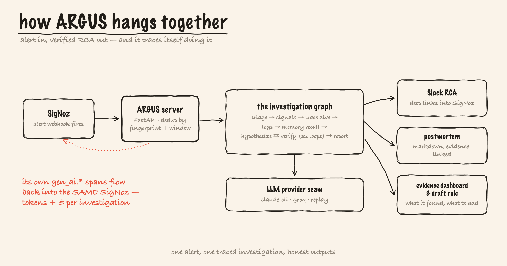
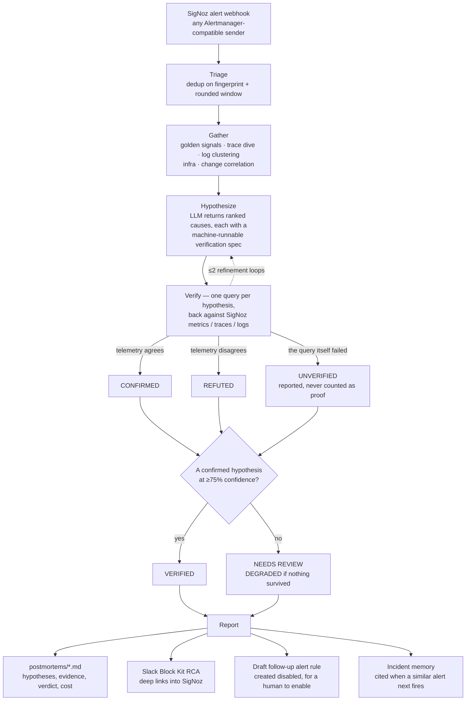

<div align="center">


# ARGUS

**An autonomous AI SRE for self-hosted SigNoz: it investigates alerts, verifies root cause against your telemetry, and posts an evidence-linked RCA.**

**153** tests · **20** recorded investigations · **1** live-verified RCA at **90%** · **3/3** on the replay evals · **$0.94** total LLM spend · **zero-dependency** console

[](LICENSE)
[](pyproject.toml)
[](https://github.com/vinayaksonthalia/argus/commits)
[](https://github.com/vinayaksonthalia/argus)

[See it work](#see-it-work) · [Why](#why-its-different) · [Quickstart](#quickstart) · [Tour](#the-15-minute-tour) · [Architecture](#architecture) · [Status](#status) · [Limits](#honest-limits) · [Compatibility](#compatibility-and-uninstall)

</div>

## See it work

A SigNoz alert fires. Nobody types a question. ARGUS investigates across metrics, traces, and logs, tests each hypothesis against real queries, and posts a root cause you can click into SigNoz — tracing its own reasoning back into that SigNoz, tokens and dollars included.

<p align="center">
  
</p>

<p align="center"><sub>It opens on the run that cleared the 75% bar, then filters to one that <em>refused</em> to conclude.</sub></p>

| The claim — one hypothesis CONFIRMED, two REFUTED | The proof — the 25s `SELECT` span, in real SigNoz |
|---|---|
| [](assets/screenshots/10-console-detail.png) | [](assets/screenshots/06-hero-trace-pg-sleep-waterfall.png) |

That flagship run, `inv-fcdb95f553`, named the actual injected fault — a `pg_sleep(2.5)` buried in the catalog service's products `SELECT` — and proved it mechanically ("found 'pg_sleep' in 20 matching rows"), from a real alert on real telemetry against a real Claude model. [Receipts](assets/live-e2e-VERIFIED-HERO-inv-fcdb95f553-postmortem.md).

## Why it's different

> At 2 a.m. you don't need a chatbot to ask questions of — you need the answer already waiting. ARGUS is triggered by the alert webhook, not a human prompt, and it cannot bluff: every hypothesis carries a machine-runnable, falsifiable verification spec, and any claim the telemetry doesn't back is **refuted**, not reported.

- **Verified, not vibes.** Each hypothesis is confirmed or refuted by a real before/after query; below 75% confidence a run flags itself for human review instead of overclaiming.
- **Self-observing.** Every investigation is an `argus.investigation` trace — one OTel span per node, carrying `gen_ai.usage.*` and `argus.cost.usd` — flowing back into the SigNoz it queries.
- **Hardened.** Telemetry reaches the model only inside delimiter-escaped, length-capped `<telemetry>` blocks, and its sole side-effect is constrained JSON, whitelist-validated before a query is built — so verification is the honesty mechanism *and* the [prompt-injection firewall](DOCS.md#security-model).
- **Replayable.** Recorded incidents replay with no SigNoz, no LLM, and no secrets, doubling as an evals harness scoring RCA accuracy.

## The pager story

<p align="center">
  
</p>

## Quickstart

Requires Python 3.11+ and [uv](https://docs.astral.sh/uv/).

```bash
git clone https://github.com/vinayaksonthalia/argus && cd argus
uv venv && uv pip install -e ".[dev]"
```

**Offline demo** — no SigNoz, no API keys, no network:

```bash
uv run argus investigate --replay fixtures/incident-1   # the flagship slow-db incident
uv run argus console                                    # read-only UI on http://127.0.0.1:7332
```

The replay prints node-by-node progress, the verified RCA, the Block Kit payload (dry-run by default), a postmortem in `postmortems/`, and the token/cost line — from fixtures carrying real token counts, so cost tracking works offline too.

**Slack**, guided in about two minutes:

```bash
uv run argus slack-setup    # scripted: --token xoxb-… --channel '#incidents' --yes
```

It creates the app, live-validates the token, sends a real test message, and writes `.env` (`chmod 600`, token never printed). Without a token ARGUS stays in dry-run. [Full flow](DOCS.md#connecting-slack-argus-slack-setup).

**Live mode:**

```bash
cp .env.example .env    # startup refuses placeholder values
uv run argus serve      # webhook server on :7331
```

Point a SigNoz webhook notification channel at `http://<host>:7331/webhook/signoz`. Alerts are deduplicated — a re-delivery returns the existing investigation — one in flight per service. Set `OTEL_EXPORTER_OTLP_ENDPOINT` and ARGUS's traces appear in that same SigNoz. Faultline services, fault injection, and a real alert through the loop: [the live demo](DOCS.md#run-the-live-demo-in-5-commands).

## The 15-minute tour

From a cold clone to the artifact worth arguing about: a verified root cause next to the runs that weren't. Offline throughout; each step lists the line you should see.

**1 — Install** (~2 min) — the two commands above.

> `Installed N packages` — nine runtime deps, all for the *live* path.

**2 — Replay the flagship incident: a slow database** (~1 min)

```bash
uv run argus investigate --replay fixtures/incident-1
```

> `ROOT CAUSE VERIFIED · confidence 90%` — eleven nodes tick past; one hypothesis lands CONFIRMED, the rest REFUTED with the query that killed each.

**3 — Replay the other two** (~2 min)

```bash
uv run argus investigate --replay fixtures/incident-2
uv run argus investigate --replay fixtures/incident-3
```

> `NEEDS HUMAN REVIEW · confidence 60%`, then `ROOT CAUSE VERIFIED · confidence 75%` — the first had thin but real evidence and flagged itself rather than dress 60% up as an answer; the second, a deploy-correlated regression, landed exactly on the threshold.

**4 — Score all three against ground truth** (~1 min)

```bash
uv run argus eval fixtures/incident-1 fixtures/incident-2 fixtures/incident-3
```

> `3/3 cases passed` — six checks per case against its `ground_truth.json` ([the checks](DOCS.md#replay-and-evals-harness)).

**5 — Run the test suite** (~1 min)

```bash
uv run pytest -q
```

> `153 passed` — every node against recorded fixtures, plus an XSS suite proving hostile payloads render inert.

**6 — Open the Investigations Console** (~4 min — the main stop)

```bash
uv run argus console      # http://127.0.0.1:7332
```

> It opens on `inv-fcdb95f553` — VERIFIED, deliberately not the newest run. One hypothesis card is CONFIRMED, the others REFUTED, muted but never dropped. The chips read `Verified 1` · `Review 13` · `Degraded 6`; open a Degraded one for *"no hypothesis survived verification."* One in twenty cleared the bar, and that ratio is published, not massaged.

**7 — Browse the same corpus with nothing installed** (~2 min)

```bash
python3 -m http.server -d docs 8000    # http://localhost:8000
```

> `Serving HTTP on :: port 8000` — `docs/` is that console rendered to static files by `scripts/export_console.py`, from the same `render.py` and CSS, so it cannot drift.

**8 — Check the receipts** (~2 min) — everything above is offline replay; the claims needing a live system have their evidence written down:

| Claim | Proof |
|---|---|
| The flagship RCA came from a real alert and a real Claude call | [postmortem](assets/live-e2e-VERIFIED-HERO-inv-fcdb95f553-postmortem.md) |
| The same fault, seen in SigNoz itself | [trace waterfall](assets/screenshots/06-hero-trace-pg-sleep-waterfall.png) |
| **Slack posting is real** — `chat.postMessage` returned HTTP 200 twice, to a real workspace | [verification](assets/live-slack-posting-verified.md) · [payload](assets/live-e2e-1-slack-blocks-inv-4199347358.json) |
| Its own reasoning traced back into SigNoz, with cost | [Mission Control](assets/screenshots/03-mission-control-dashboard.png) |

## Architecture

<p align="center">
  
</p>

And the loop itself, decision by decision. Every hypothesis leaves the model with a machine-runnable verification spec attached, and that spec is what decides the badge — the model never grades its own answer.



Two seams make this testable offline. **`SignozTransport`** tags every SigNoz read, making `HttpTransport` (live `/api/v5/query_range`), `ReplayTransport` (recorded JSON), and `ARGUS_TRANSPORT=mcp` (the SigNoz MCP server) interchangeable; **`LLMProvider`** swaps live Claude for the local `claude` CLI, any OpenAI-compatible endpoint, a heuristic, or recorded completions. Both outer edges are standards, not per-vendor adapters — any Alertmanager-compatible webhook in, plain OTLP with `gen_ai.*` attributes out — so vanilla Prometheus Alertmanager pages ARGUS identically and SigNoz's LLM views render its traces with zero config. Full design, seams, and [illustrations](assets/illustrations/): [`DOCS.md`](DOCS.md).

## Status

Live-verified unless marked otherwise; evidence in [`assets/`](assets/).

| Capability | Status | Evidence |
|---|---|---|
| End-to-end loop: webhook → dedup → golden signals → trace dive → log clustering → hypothesize → verify → Slack RCA → postmortem | ✅ Live-verified | [`inv-fcdb95f553`](assets/live-e2e-VERIFIED-HERO-inv-fcdb95f553-postmortem.md) |
| Per-hypothesis confidence, review threshold, self-flagging | ✅ Live-verified | [`inv-3a51fe90dd`](assets/live-e2e-degraded-run-inv-3a51fe90dd-postmortem.md) |
| Self-instrumentation + Mission Control dashboard | ✅ Live | [screenshot](assets/screenshots/03-mission-control-dashboard.png) |
| Incident memory: SQLite + hashed-TF recall, cited in the RCA | ✅ Live-verified | [`inv-977e5fd4e8`](assets/live-memory-recall-inv-977e5fd4e8-postmortem.md) |
| Pluggable providers: `anthropic` / `claude-cli` / `groq` / `cerebras` / `heuristic` / `replay` | ✅ Live (groq verified, cerebras 402-limited) | [benchmark](evals/PROVIDER-BENCHMARK.md) |
| Act node: evidence dashboard + `[DRAFT · ARGUS]` rules (always `disabled: true`) | ✅ Live-verified | [dashboard](assets/screenshots/05-hero-incident-evidence-dashboard.png) · [rules](assets/screenshots/08-alert-rules-incl-draft.png) |
| Spend meta-alert: `argus.cost.usd` → rule → webhook → ARGUS pages ARGUS | ✅ Live-verified | [dashboard](assets/screenshots/04-meta-incident-argus-pages-itself-dashboard.png) |
| MCP transport behind the same seam | ✅ Live (scored 55% and self-flagged — which is what proves it) | [`inv-5736466ee5`](assets/live-mcp-transport-inv-5736466ee5-postmortem.md) |
| Live Slack posting: `chat.postMessage` Block Kit RCA | ✅ Live-verified (HTTP 200) | [receipt](assets/live-slack-posting-verified.md) |
| Replay + evals harness scored against ground truth | ✅ Deterministic | `fixtures/incident-{1,2,3}` |
| Foundry single-cast deploy (SigNoz + ARGUS + Faultline) | ⚠️ Generation dry-run validated | `deploy/casting.yaml` |
| Multi-service blast-radius correlation | ❌ Planned | single-service analysis today |

## Honest limits

Blast radius is single-service · the Anthropic SDK path is exercised through `claude-cli`, not a raw API key · incident-memory similarity uses local hashed-TF embeddings over a small corpus, so recall grows with use · a verification spec can 404 on a field that was never ingested, costing that hypothesis rather than faking it · trace operators (`A => B`) are avoided, as they generate malformed SQL on the verified SigNoz version · `foundryctl cast` was dry-run validated, never executed. Each is expanded in [`DOCS.md`](DOCS.md#whats-still-open-honest) and the [FAQ](learning/README.md).

## Compatibility and uninstall

Built and live-verified against **self-hosted SigNoz v0.132.2** — reads to `/api/v5/query_range`, writes to `/api/v1/dashboards` and `/api/v2/rules`. **SigNoz Cloud is untested:** Cloud API-key auth may work as-is, but self-telemetry would need the Cloud ingestion endpoint.

**Uninstall:** stop the webhook server, point the SigNoz webhook channel away from `/webhook/signoz`, and delete the ARGUS-created dashboards and any `[DRAFT · ARGUS]` rules. Nothing else needs cleanup. [Step by step](DOCS.md#compatibility-signoz-cloud-and-uninstall).

## Learn

[`learning/`](learning/README.md) is a full curriculum: the big picture, the investigation loop, a SigNoz API deep-dive, the stack and its trade-offs, an FAQ and glossary, the design rationale, and a bug-hunt diary.

## License

MIT — see [`LICENSE`](LICENSE).

---

## AI disclosure

ARGUS uses Anthropic Claude as its reasoning model behind a pluggable provider interface (Claude / Groq / any OpenAI-compatible endpoint, or fully offline replay); every root-cause claim is verified against real SigNoz queries before it is reported. Claude Code was also used as a pair-programmer during development and testing — every design decision, live verification, and claim in this repo was reviewed against real evidence, and [`assets/`](assets/) holds the receipts.

<div align="center"><sub>Built for the SigNoz observability ecosystem · every claim in this file links to its proof.</sub></div>
